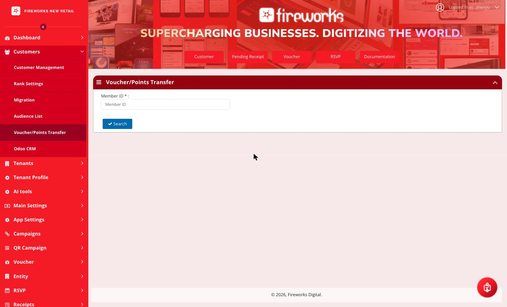
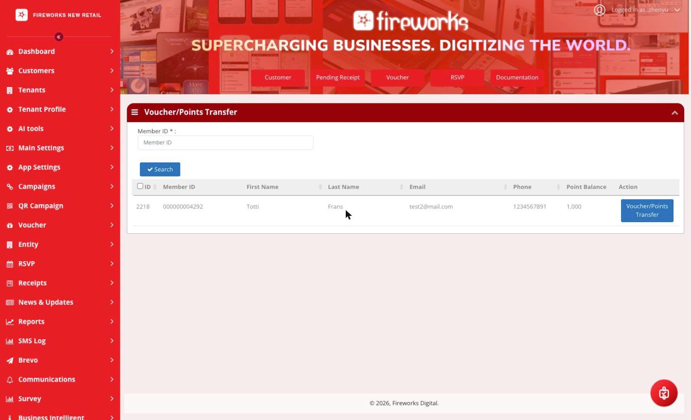
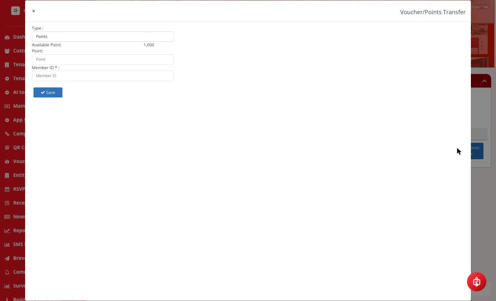

# Voucher/Points Transfer

Learn how to transfer loyalty points or vouchers between customer accounts.

## Overview

The Voucher/Points Transfer module allows administrators to transfer loyalty points or vouchers from one customer account to another. This is useful for account merges, customer requests, or correcting errors.

## Accessing Voucher/Points Transfer

Navigate to Customer > Voucher/Points Transfer

<figure><figcaption></figcaption></figure>

## How to Transfer Points or Vouchers

### Step 1: Search for the Customer

Enter the source customer's Member ID in the search field and click Search.

<figure><figcaption></figcaption></figure>

### Step 2: Click the Voucher/Points Transfer Button

In the search results, find the customer record and click the Voucher/Points Transfer button in the&#x20;

Action column.

### Step 3: Fill in the Transfer Form

A popup form will appear with the following fields:

<figure><figcaption></figcaption></figure>

Complete the following fields in the form:

| Field           | Description                                                                                                |
| --------------- | ---------------------------------------------------------------------------------------------------------- |
| Type            | Select the transfer type: Points to transfer loyalty points, or Voucher to transfer a voucher.             |
| Available Point | Displays the source customer's current available point balance. This is a read-only field.                 |
| Point           | Enter the number of points to transfer to the destination customer. Applicable when Type is set to Points. |
| Member ID       | Enter the Member ID of the destination customer who will receive the points or voucher.                    |

### Step 4: Click Save

Click the Save button to complete the transfer. The points or voucher will be transferred from the source customer's account to the destination customer's account immediately.
