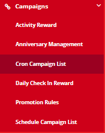

# Campaigns Overview

Create and manage marketing campaigns, promotions, and engagement activities in the Loyalty CRM system.

## Overview

The Campaigns module provides tools for creating various types of marketing campaigns to engage loyalty program members.

<figure><figcaption></figcaption></figure>

## Campaign Types

| Type                   | Description                    |
| ---------------------- | ------------------------------ |
| **Cron Campaigns**     | Automated recurring campaigns  |
| **Schedule Campaigns** | Time-based scheduled campaigns |
| **Daily Check-In**     | Rewards for daily engagement   |
| **Promotion Rules**    | Point multipliers and bonuses  |
| **QR Campaigns**       | QR code-based engagement       |

## Module Components

### Campaign Management

* [Create Campaign](create-campaign.md) - Set up new campaigns
* [Daily Check-In Reward](daily-checkin-reward.md) - Configure check-in rewards
* [Schedule Campaigns](schedule-campaigns.md) - Plan scheduled campaigns

### Promotion Management

* [Promotion Rules](promotion-rules.md) - Configure point multipliers and bonuses

### QR Code Campaigns

* [QR Generator](qr-generator.md) - Generate QR codes for campaigns
* [Create QR Page](create-qr-page.md) - Build QR landing pages

## Accessing Campaigns

Navigate to **Campaigns** from the main menu.

## Campaign List View

The campaign list displays:

| Column        | Description               |
| ------------- | ------------------------- |
| Campaign Name | Title of the campaign     |
| Type          | Campaign type             |
| Status        | Active/Inactive/Scheduled |
| Start Date    | Campaign start            |
| End Date      | Campaign end              |
| Actions       | Edit/Delete/View          |

## Quick Start

### Creating Your First Campaign

1. Navigate to **Campaigns > Create Campaign**
2. Select campaign type
3. Configure campaign details
4. Set target audience
5. Define rewards/actions
6. Schedule and activate

## Best Practices


**Campaign Planning:**

* Define clear objectives
* Identify target audience
* Set measurable KPIs
* Plan communication strategy
* Prepare for campaign end



**Testing:** Always test campaigns with a small audience before full launch to ensure:

* Triggers work correctly
* Rewards are distributed properly
* Communications are sent accurately



**Budget Management:** Monitor campaign costs:

* Track reward redemptions
* Monitor participation rates
* Calculate ROI regularly
* Adjust if needed


## Campaign Calendar

Plan campaigns around:

* Seasonal events
* Holidays
* Sales periods
* Product launches
* Member milestones

## Related Topics

* [Create Campaign](create-campaign.md)
* [Promotion Rules](promotion-rules.md)
* [QR Generator](qr-generator.md)
* [Communications](../communications/)
* [Reports](../reports/campaign-reports.md)
